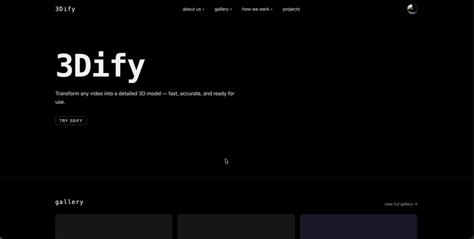

# 3Dify
Turn 360° videos into realistic 3D models in minutes.

---

<div align="center">
  
  &nbsp;
  
</div>

## Overview
3Dify lets you upload a 360° video of any object and get back a downloadable 3D model — no expensive scanners or manual setups required. The backend sends your video to the KIRI Engine API for reconstruction, then stores the result in Firebase for you to preview and download.

## Tech Stack

### Frontend
- **React** — UI library
- **Vite** — Build tool
- **Tailwind CSS v4** — Utility-first styling
- **Three.js** — In-browser 3D model viewer

### Backend
- **Flask** — Python web framework
- **KIRI Engine API** — Cloud-based 3D reconstruction from video

### Cloud / Database
- **Firebase** — Authentication, Firestore (database), and Cloud Storage

## Features
- Upload a 360° video of an object
- KIRI Engine processes the video into a 3D model
- Preview the model in-browser with an interactive 3D viewer
- Download the completed model as a `.zip`
- User accounts with personal model galleries (via Firebase)
- Projects page to track and manage your scans

## Project Structure
```
Aztech/
├── 3Dify/                  # React + Vite frontend
│   ├── src/
│   │   ├── components/     # ModelViewer, ModelThumbnail, UploadVideo
│   │   ├── pages/          # LandingPage, CreatePage, ProjectsPage, GalleryPage
│   │   ├── services/       # Firebase scan helpers
│   │   └── context/        # AuthContext
│   └── backend/            # Flask backend
│       ├── blueprints/     # kiri.py — KIRI API integration
│       └── main.py         # App entry point
```

## Getting Started

### Prerequisites
- Node.js + npm
- Python 3.10+
- Firebase project with Firestore and Storage enabled

### 1. Run Frontend
```bash
cd 3Dify
npm install
npm run dev
```

### 2. Run Backend
```bash
cd 3Dify/backend
source venv/bin/activate   # or: venv/bin/python3 main.py
python3 main.py
```

> **Mock mode:** `MOCK_MODE = True` in `blueprints/kiri.py` simulates the full processing pipeline without hitting the KIRI API. Set it to `False` to use the real API.

### 3. Firebase Setup
```bash
firebase login
firebase init
firebase deploy
```

### 4. Test Auth (Optional)
Uncomment `connectAuthEmulator(auth, "http://localhost:9099");` in the Firebase config, then:
```bash
firebase emulators:start
```

## Team Aztech
- Jahnavi Panchal — jpanchal7872@sdsu.edu
- Matthew Tran — mtran4477@sdsu.edu
- Santiago Verdugo — sverdugo3119@sdsu.edu

## Future Plans
- Add measurement tools to scale models for 3D printing
- Support additional export formats (STL)
- Share models publicly via gallery links
